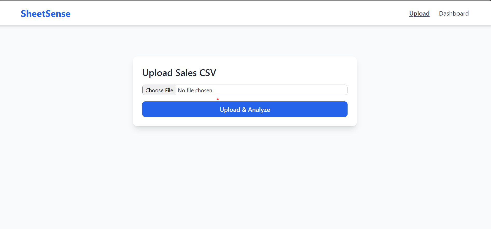
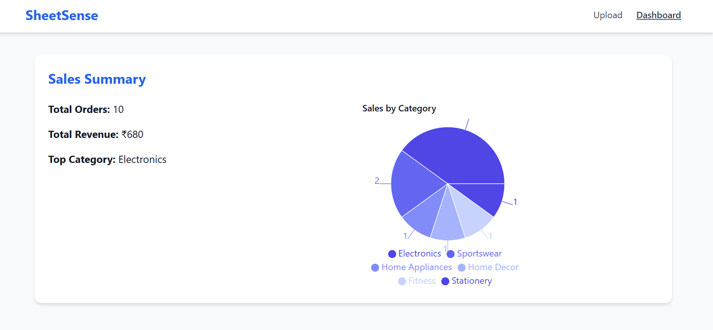

# SheetSense

**SheetSense** is a web application that allows users to upload CSV files containing sales or other relevant data, and then analyze and visualize the data using an intuitive dashboard. The application helps users get quick insights into their data by providing a range of visualizations and statistics such as total sales, revenue, and product performance. This project utilizes a modern tech stack including React, Vite, Tailwind CSS, FastAPI, and Pandas.

## Table of Contents
- [Demo](#demo)
- [Tech Stack](#tech-stack)
- [Features](#features)
- [Installation](#installation)
- [Usage](#usage)
- [API Documentation](#api-documentation)
- [License](#license)

## Demo

You can view the live demo of **SheetSense** here: [Link to Demo](#)

## Tech Stack

- **Frontend**:
  - React
  - Vite
  - Tailwind CSS
  - Recharts for data visualization

- **Backend**:
  - FastAPI
  - Python (Pandas for data analysis)
  - Uvicorn (ASGI server)

- **File Handling**:
  - CSV parsing and analysis with Python's Pandas

- **Deployment**:
  - Vercel (Frontend)
  - Heroku / AWS EC2 / Any Cloud Provider for the backend (optional)

## Features

- **File Upload**: Allows users to upload CSV files to the platform.
- **Data Analysis**: Automatically processes the uploaded CSV file and calculates key insights like total revenue, total sales, product performance, etc.
- **Data Visualization**: Presents the insights through interactive charts like pie charts, bar charts, and line graphs.
- **Responsive UI**: Built with a modern and sleek design, fully responsive on all devices.

## Installation

To get started with **SheetSense**, clone the repository and follow the steps below to set it up locally.

### 1. Clone the repository:

```bash
git clone  https://github.com/pratibhavanave/SheetSense.git

```
## Screenshots

### SheetSense Dashboard
Here’s a screenshot of the **SheetSense** Upload:


### Screenshort of Dashboard

